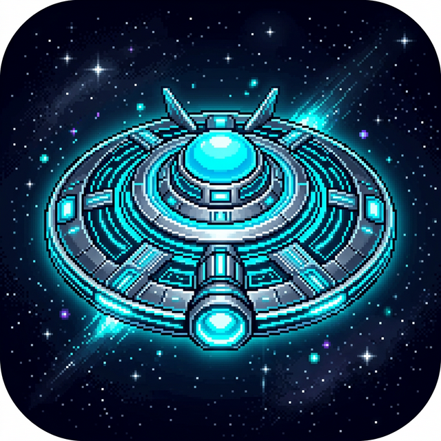

<div align="center">
  
  <h1>Cyberpunk Ghost (Galaxy Defender) 🛸</h1>
  <p><i>An action-packed, neon-infused arcade space shooter built with Flutter & Flame Engine!</i></p>

  [](https://flutter.dev/)
  [](https://flame-engine.org/)
  []()
</div>

---

## 🌟 Overview

**Cyberpunk Ghost** (internally codenamed `galaxy_defender`) is a fast-paced vertical scrolling shooter. Take control of a high-tech glowing saucer, battle against descending waves of cyber-ghost enemies, collect powerful upgrades, and rack up the highest score possible before your hull integrity fails!

This project serves as a showcase of modern mobile game development using Dart, Flutter, and the robust 2D game framework, **Flame Engine**. 

---

## 🚀 Features

### 🌌 Dynamic Parallax Environment
Experience a truly immersive deep-space setting with a multi-layered, mathematically generated scrolling starfield that creates a stunning 3D parallax effect as you fly.

### 🔊 High-Fidelity Audio Engine
The game features a fully custom-built audio engine using `flame_audio` for a premium feel:
*   **Atmospheric BGM**: A heavy, pulsating *Cyber Storm* background music loop.
*   **Dynamic Pitch Processing**: Every time you fire the `plasma_cannon`, the weapon's audio pitch slightly shifts in real-time (ranging between 0.9x to 1.1x) to prevent audio fatigue and make the weapon feel incredibly mechanical and organic.
*   **Satisfying Impacts**: Enemy destruction triggers a deep, resonant `bass_impact.wav` to make every kill feel rewarding.
*   **Intelligent Audio Ducking**: When the Game Over screen interrupts the action, the background music volume automatically "ducks" (lowers to 20%) so you can focus on the UI menu seamlessly.
*   **In-Game Toggle**: A sleek floating HUD button saves your mute preferences permanently using `SharedPreferences`.

### ⚡ Power-Ups & Upgrades
Survive longer by collecting falling neon capsules:
*   🟢 **Health Repair (+HULL)**: Fixes your ship's damage.
*   🔵 **Plasma Shield**: Grants temporary invincibility against the next collision.
*   🟣 **Spread-Shot**: Upgrades your base laser into a devastating 3-way spread attack.

### 👾 Adaptive Difficulty
The game never stops getting harder. As your score hits specific milestones (500 pts, 1000 pts), you trigger a **LEVEL UP** event! The background nebula shifts colors (from Black to Deep Void Blue, to Red Alert), and enemy spawn rates drastically increase.

### 📱 Responsive Touch Controls
Built mobile-first:
*   **Drag anywhere** to move the ship 1:1 with your finger (Pan Detector).
*   **Tap anywhere** to fire your weapons.

---

## 🕹️ How to Play

### Objectives
1.  **Survive**: Don't let the cyber-ghosts touch your ship! You start with 3 lives (HULL INT).
2.  **Destroy**: Tap the screen to shoot enemies out of the sky (+10 Score per kill).
3.  **Collect**: Grab power-ups to heal, shield yourself, or gain the spread-shot.

### HUD Breakdown
*   **SCORE**: Your current points. Your High Score is saved locally to your device.
*   **HULL: INT**: Full Health (Green).
*   **HULL: DMG**: Damaged (Orange).
*   **HULL: CRT**: Critical Damage (Red) - one more hit means Game Over!

---

## 🛠️ Installation & Setup

Want to play it or modify the code yourself? Follow these steps:

### Prerequisites
*   [Flutter SDK](https://docs.flutter.dev/get-started/install) (Version 3.11.0 or higher recommended)
*   An Android Emulator, iOS Simulator, or connected mobile device.

### Running the Game

1.  **Clone the Repository**
    ```bash
    git clone https://github.com/venugopalreddyg99-ai-venu/Cyberpunk-Ghost.git
    cd Cyberpunk-Ghost
    ```

2.  **Fetch Dependencies**
    ```bash
    flutter pub get
    ```

3.  *(Optional but Required for Sound)* **Add Audio Files**
    Due to copyright/size, you must manually supply three audio files to the `assets/audio/` folder inside the project root:
    *   `cyber_storm.mp3`
    *   `plasma_cannon.wav`
    *   `bass_impact.wav`

4.  **Run the Game**
    ```bash
    flutter run
    ```

### 📦 Download the Ready-To-Play APK
If you just want to install the game on your Android phone without messing with code, grab the pre-compiled APK!

You can build the Release APK yourself by running:
```bash
flutter build apk --release
```
Provide the output file `build/app/outputs/flutter-apk/app-release.apk` directly to your Android device to install and play.

---

## 📁 Project Architecture

The codebase is organized cleanly to separate Flutter UI overlays from the core Flame game loop.

```text
lib/
├── game/
│   ├── galaxy_defender_game.dart   # The core FlameGame loop & engine state
│   ├── player.dart                 # The PlayerShip component & movement logic
│   ├── enemy.dart                  # Ghost enemy AI & behaviors
│   ├── bullet.dart                 # Projectile mechanics & hitboxes
│   └── power_up.dart               # Loot drops
├── overlays/
│   ├── start_overlay.dart          # Main Menu UI
│   ├── game_over_overlay.dart      # Death Screen UI
│   └── sound_toggle_overlay.dart   # Floating Audio Settings UI
└── main.dart                       # Flutter entry point & overlay routing
```

---

## 💻 Tech Stack & Dependencies

*   [Flutter](https://flutter.dev/) - UI Framework
*   [Flame](https://pub.dev/packages/flame) (^1.35.1) - 2D Game Engine for Flutter
*   [flame_audio](https://pub.dev/packages/flame_audio) (^2.11.14) - For background loops, dynamic pitch, and SFX mixing
*   [shared_preferences](https://pub.dev/packages/shared_preferences) (^2.5.4) - Local persistent storage for High Scores & Settings
*   [flutter_launcher_icons](https://pub.dev/packages/flutter_launcher_icons) (^0.14.4) - Asset generator for the custom app icons

---
<p align="center"><i>Made with ❤️ and Flutter.</i></p>
